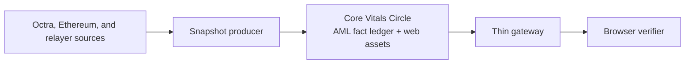
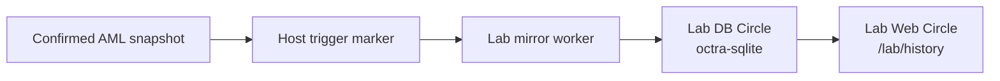

# Octra Vitals

**A self-verifying accounting instrument for Octra.**

Octra Vitals observes Octra supply, bridge collateral, wrapped OCT issuance, and recovery state, then commits canonical snapshots into an Octra AML fact ledger. The browser experience re-checks those commitments before it trusts what it renders.

This is not a dashboard backed by a private database. The product is designed around a smaller claim:

> Make the accounting visible, source-linked, and hard to silently fake.

- Mainnet: [octra.live](https://octra.live)
- Devnet: [devnet.octra.live](https://devnet.octra.live)
- History Lab: [octra.live/lab/history](https://octra.live/lab/history)

## What It Shows

Vitals focuses on the relationships that matter:

- OCT in circulation
- burned OCT
- encrypted OCT
- OCT locked in the bridge vault
- wOCT minted on Ethereum
- claimable recovery collateral
- unclassified bridge residuals
- the snapshot, program, source references, and raw evidence behind those numbers

Derived values are labeled as derived. Residuals are shown openly rather than hidden. The product answers the practical question: **does the accounting reconcile?**

## Trust Model

**AML is canonical.** The Octra AML fact ledger records ordered snapshots, compact historical facts, hashes, roots, source references, and conservation status.

**The Circle carries the product.** The core Vitals Circle contains the canonical AML program and the canonical web assets.

**The gateway is a shim.** It adapts normal browser HTTP to Octra reads, serves APIs, and runs operator diagnostics. It should not invent truth.

**The browser verifies before rendering.** In a normal browser, the page re-derives hashes, checks commitments, recomputes the conservation verdict, and exposes the on-chain anchors. In a Circle-native client, the trust boundary can be stronger because the client can read the Circle directly.

**Failures are visible.** If required program-backed data is stale, missing, or inconsistent, the UI fails closed instead of rendering sample values.

## Architecture



The producer observes. AML records and orders. The browser verifies. The gateway stays boring.

## History Lab

History Lab is the exploratory layer for longer-horizon analysis. It is powered by [`octra-sqlite`](https://github.com/tomismeta/octra-sqlite), which makes it possible to query a real SQLite database stored in an Octra Circle.

The Lab is intentionally **derived**, not canonical:

- canonical truth remains the Vitals AML fact ledger;
- the Lab mirror writes only after a confirmed AML snapshot write;
- the mirror is decoupled from the core updater, so Lab failure does not block Vitals;
- the Lab database lives in its own sealed Octra SQLite Circle;
- the Lab web assets live separately from the core Vitals Circle;
- Lab queries are bounded, read-only, and meant for discovery.

Current Lab capabilities:

- canned history, table, and schema queries;
- adjustable history windows and row limits;
- editable read-only SQL for deeper inspection;
- relational tables derived from verified AML readback.



The Lab makes history easier to explore. It does not replace the ledger.

## Deployment Shape

Production is split by responsibility:

| Layer | Purpose |
| --- | --- |
| Core Vitals Circle | AML canonical state and canonical Vitals web assets |
| Gateway host | Browser compatibility, APIs, diagnostics, snapshot producer |
| Lab Web Circle | Public History Lab assets |
| Lab DB Circle | Sealed `octra-sqlite` history mirror |

Devnet and stage should rehearse the same shape before mainnet changes.

## Data Shape

The AML fact ledger stores compact, ordered facts rather than a private analytics database. Core accounting is family zero by policy. Additional fact families can extend the ledger without changing the core accounting row.

Historical facts are grouped into deterministic capsules with ranges and roots, so history can be verified without replaying everything from genesis. Rich raw bodies and long-form evidence remain outside AML by content hash.

## Local Development

Requires Node 22.

```bash
npm install
npm run snapshot:sample
npm run dev
```

Open:

```text
http://127.0.0.1:4173
```

Common checks:

```bash
npm run check
npm test
npm run native:verify
```

Useful routes:

```text
/api/latest
/api/history
/api/version
/api/site-integrity
/api/native-readiness
/api/evidence/raw/<sha256>
/lab/history
/health
```

## Repository Map

```text
app/                  Browser assets
program-fact-ledger/  AML fact ledger
src/                  Producer, gateway, verification, and release tooling
deploy/               Host and systemd automation
ops/                  Lab schema and operational assets
docs/                 Architecture, operations, and decision records
```

Runtime and generated files are ignored:

```text
build/
dist/
data/
reports/
app/producer.audit.json
```

## Documentation

Start with:

- [Architecture](docs/architecture.md)
- [Operations](docs/ops.md)
- [Release Management](docs/release-management.md)
- [Mainnet Deployment](docs/mainnet-deployment.md)
- [History Lab Mirror](docs/lab-history-mirror.md)
- [Costs](docs/costs.md)
- [Readiness](docs/readiness.md)

Key decisions:

- [ADR 0001: Programmed Site Circle](docs/adr-0001-programmed-site-circle.md)
- [ADR 0002: AML History Era Model](docs/adr-0002-aml-history-era-model.md)
- [ADR 0003: Fact Ledger History](docs/adr-0003-fact-ledger-history.md)

Related:

- [`tomismeta/octra-sqlite`](https://github.com/tomismeta/octra-sqlite)

## Security

No wallet material belongs in git, chat, Circle assets, or public logs.

Host secrets live under `/etc/octra-vitals`. Runtime data lives under `/var/lib/octra-vitals`. The gateway exposes verification artifacts, not operator credentials.

If something cannot be verified, the product should say so plainly.

## License

MIT
